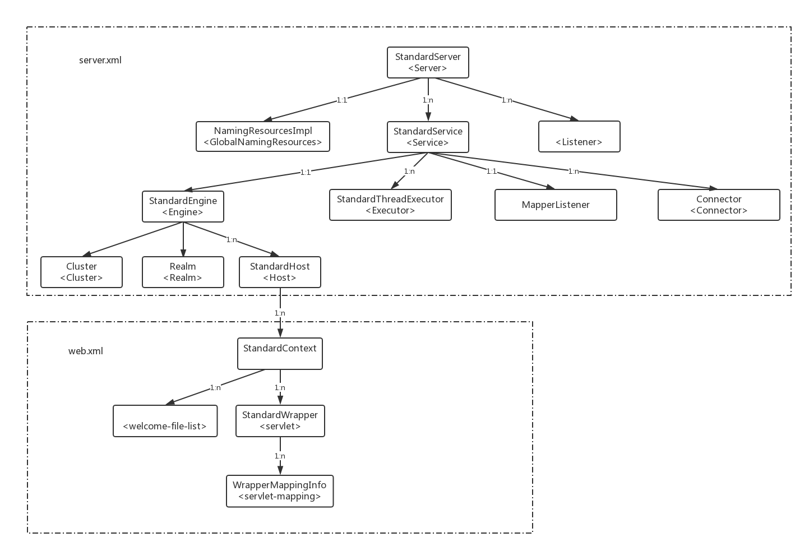

在前面的文档中介绍过了，在`Bootstrap`、`Catalina`中调用`load()`方法中，使用`Digester`类将`server.xml`中的元素解析为对应的类（它们共同的父类是抽象的`LifecycleBase`，默认的配置通过`Catalina#createStartDigester()`定义），最后就是调用`server.xml`中顶级元素`<Server>`对应的类的`StandardServer`的`init()`方法（每个元素的默认对应的类都是以`Standard`开头，例如`<Service>`对应`StandardService`）。从顶级元素开始，从上到下，依次调用子元素的对应方法。而且使用了模板方法模式，在父抽象类中定义了模板方法，在模板方法中调用抽象方法，子类实现各自的抽象方法，例如对于`init()`：
```java
public final synchronized void init() throws LifecycleException {
    //...
    setStateInternal(LifecycleState.INITIALIZING, null, false);
    initInternal();// 1
    setStateInternal(LifecycleState.INITIALIZED, null, false);
    //...
}
protected abstract void initInternal() throws LifecycleException;
```
类似的还有`start()`--->`startInternal()`、`stop()`--->`stopInternal()`、`destroy()`--->`destroyInternal()`。只是在位置1处调用对应的`--->`后面的方法。但是`setStateInternal()`方法是在调用前和调用后都会执行，不同的是`LifecycleState`的枚举值不同，`setStateInternal()`方法的参数不同。</br>
`setStateInternal()`方法的作用主要是设置`LifecycleBase#LifecycleState`域的值，而每一个`LifecycleState`枚举都对应一个`String`类型的事件`lifecycleEvent`。设置完成后触发对事件`lifecycleEvent`的处理：将`String`类型的`lifecycleEvent`封装为一个`LifecycleEvent`类型的对象，里面保存了`String`类型的`lifecycleEvent`、当前正在处理的的`LifecycleBase`对象、以及附加信息，然后遍历`LifecycleBase#lifecycleListeners`中的`LifecycleListener`对象，并且调用`LifecycleListener#lifecycleEvent()`来处理感兴趣的Object上的感兴趣的event。由于`lifecycleListeners`是在`server.xml`中每个元素的父类`LifecycleBase`中，所以可以对`server.xml`中每一个元素设置`<Listener>`监听器，并且指定对应的处理类，处理类只需要实现`LifecycleListener`接口。

对于正常的启动流程，调用层次是：</br>
`Bootstrap#load()`--></br>
`Catalina#load()`--></br>
`StandardServer#init()`（`<Server>`）--></br>
（子元素的`init()`方法）</br></br>

`Bootstrap#start()`--></br>
`Catalina#start()`--></br>
`StandardServer#start()`（`<Server>`）--></br>
（子元素的`start()`方法）</br>

所以我们分析一个组件的功能，查看对应的方法的顺序是：`initInternal()`-->`startInternal()`-->`stopInternal()`-->`destroyInternal()`

`StandardWrapper`是最底层的容器，不支持增加一个子容器（`addChild()`方法抛出异常）
