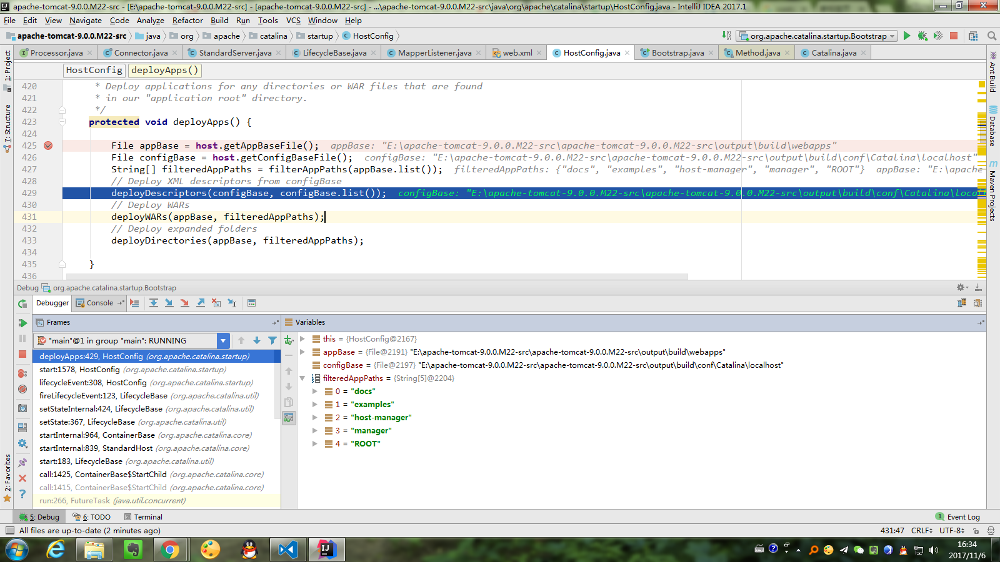

`Request`和`Response`是在抽象类`AbstractProcessor`的构造函数中创建的
```java
    public AbstractProcessor() {
        this(new Request(), new Response());
    }

    protected AbstractProcessor(Request coyoteRequest, Response coyoteResponse) {
        asyncStateMachine = new AsyncStateMachine(this);
        request = coyoteRequest;
        response = coyoteResponse;
        response.setHook(this);
        request.setResponse(response);
        request.setHook(this);
    }
```
启动Tomcat后，在`AbstractProcessorLight#process()`方法中加断点，然后在浏览器中输入地址：http://127.0.0.1:8080/. 
1. 第一次的时候，会调用`AbstractProcessor`的构造函数（创建子类`Http11Processor`，第二次就不需要了，因为`AbstractProtocol#process()`中会将`processor`缓存起来）
2. 在`AbstractProcessorLight#process()`方法中，`status == SocketEvent.OPEN_READ`为真，所以调用`service()`方法，即`Http11Processor#service()`方法。
3. `Http11Processor#service()`方法中，根据处理进度不断调用`RequestInfo.setStage()`方法，将值设置为`Constants`的值：
```java
    // Request states
    public static final int STAGE_NEW = 0;
    public static final int STAGE_PARSE = 1;
    public static final int STAGE_PREPARE = 2;
    public static final int STAGE_SERVICE = 3;
    public static final int STAGE_ENDINPUT = 4;
    public static final int STAGE_ENDOUTPUT = 5;
    public static final int STAGE_KEEPALIVE = 6;
    public static final int STAGE_ENDED = 7;
```
4. `org.apache.coyote.Constants.STAGE_PARSE`. 调用`Http11InputBuffer#parseRequestLine()、parseHeaders()`方法解析Http头部。解析完头部后，信息保存在`Http11InputBuffer#MimeHeaders headers`中。然后单独对"upgrade"做了处理，从`headers`的`Connection`value中查找是否含有"upgrade"，如果有，则依次调用`AbstractProcessor#action()`方法：`action(ActionCode.CLOSE,  null);`、`action(ActionCode.UPGRADE, upgradeToken);`
5. `org.apache.coyote.Constants.STAGE_PREPARE`. 调用的是`Http11Processor#prepareRequest()`方法. `prepareRequest()`方法中，主要是调用了`Http11Processor#addInputFilter()`、`Http11InputBuffer#addActiveFilter()`方法，将`InputFilter`加入到`Http11InputBuffer#InputFilter[] activeFilters`中。`Http11Processor`构造函数中，已经为`inputBuffer(Http11InputBuffer)`和`outputBuffer(Http11OutputBuffer)`加入了filter，这些filter是`Http11InputBuffer#InputFilter[] filterLibrary`和`Http11OutputBuffer#OutputFilter[] filterLibrary`：
```java
        inputBuffer = new Http11InputBuffer(request, protocol.getMaxHttpHeaderSize());
        request.setInputBuffer(inputBuffer);

        outputBuffer = new Http11OutputBuffer(response, protocol.getMaxHttpHeaderSize());
        response.setOutputBuffer(outputBuffer);

        // Create and add the identity filters.
        inputBuffer.addFilter(new IdentityInputFilter(protocol.getMaxSwallowSize()));
        outputBuffer.addFilter(new IdentityOutputFilter());

        // Create and add the chunked filters.
        inputBuffer.addFilter(new ChunkedInputFilter(protocol.getMaxTrailerSize(),
                protocol.getAllowedTrailerHeadersInternal(), protocol.getMaxExtensionSize(),
                protocol.getMaxSwallowSize()));
        outputBuffer.addFilter(new ChunkedOutputFilter());

        // Create and add the void filters.
        inputBuffer.addFilter(new VoidInputFilter());
        outputBuffer.addFilter(new VoidOutputFilter());

        // Create and add buffered input filter
        inputBuffer.addFilter(new BufferedInputFilter());

        // Create and add the chunked filters.
        //inputBuffer.addFilter(new GzipInputFilter());
        outputBuffer.addFilter(new GzipOutputFilter());
```
然后根据一些条件，从`Http11InputBuffer#InputFilter[] filterLibrary`筛选出filter，加入到`Http11InputBuffer#InputFilter[] activeFilters`中。

6. `org.apache.coyote.Constants.STAGE_SERVICE`. 调用的是`getAdapter().service(request, response);`方法，实际调用的是`CoyoteAdapter#service()`方法。这里看到又两种`Request`和`Response`：`org.apache.coyote.Request` `org.apache.catalina.connector.Request`和`org.apache.coyote.Response` `org.apache.catalina.connector.Response`.
7. `CoyoteAdapter#service()`方法中，调用了`CoyoteAdapter#postParseRequest()`
```java
"http-nio-8080-exec-3@2942" daemon prio=5 tid=0x1b nid=NA runnable
  java.lang.Thread.State: RUNNABLE
	  at org.apache.catalina.mapper.Mapper.internalMapWrapper(Mapper.java:913)
	  at org.apache.catalina.mapper.Mapper.internalMap(Mapper.java:843)
	  at org.apache.catalina.mapper.Mapper.map(Mapper.java:699)
	  at org.apache.catalina.connector.CoyoteAdapter.postParseRequest(CoyoteAdapter.java:679)
	  at org.apache.catalina.connector.CoyoteAdapter.service(CoyoteAdapter.java:336)
	  at org.apache.coyote.http11.Http11Processor.service(Http11Processor.java:498)
	  at org.apache.coyote.AbstractProcessorLight.process(AbstractProcessorLight.java:66)
	  at org.apache.coyote.AbstractProtocol$ConnectionHandler.process(AbstractProtocol.java:796)
	  at org.apache.tomcat.util.net.NioEndpoint$SocketProcessor.doRun(NioEndpoint.java:1372)
	  at org.apache.tomcat.util.net.SocketProcessorBase.run(SocketProcessorBase.java:49)
	  - locked <0xbe7> (a org.apache.tomcat.util.net.NioEndpoint$NioSocketWrapper)
	  at java.util.concurrent.ThreadPoolExecutor.runWorker(ThreadPoolExecutor.java:1142)
	  at java.util.concurrent.ThreadPoolExecutor$Worker.run(ThreadPoolExecutor.java:617)
	  at org.apache.tomcat.util.threads.TaskThread$WrappingRunnable.run(TaskThread.java:61)
	  at java.lang.Thread.run(Thread.java:745)

```

8. `CoyoteAdapter#postParseRequest()`方法中，会调用`CoyoteAdapter#parsePathParameters()`方法解析path parameters参数，格式是：/path;name=value;name2=value2/这样的。例如我们浏览器中输入：http://127.0.0.1:8080/;name=value;name2=value2/ 。则调用`CoyoteAdapter#parsePathParameters()`方法后，会将path parameters 解析到`org.apache.catalina.connector.Request#org.apache.coyote.Request coyoteRequest#Map<String,String> pathParameters`中。例如调用`org.apache.catalina.connector.Request#getPathParameter(name)`，返回值"value"。

9. `CoyoteAdapter#postParseRequest()`方法中，又会调用`connector.getService().getMapper().map(serverName, decodedURI, version, request.getMappingData());`。对应的容器分别是：`Connector`、`StandardService`。所以取到了`StandardService#Mapper mapper`域，调用`Mapper#map()`方法. 

10. 在Tomcat启动过程中（start），调用了`Mapper#addHost()`将Host加入到`Mapper#MappedHost[] hosts`字段中，用来保存所有的host。调用栈：
```java
"main@1" prio=5 tid=0x1 nid=NA runnable
  java.lang.Thread.State: RUNNABLE
	  at org.apache.catalina.mapper.Mapper.addHost(Mapper.java:106)
	  - locked <0xab2> (a org.apache.catalina.mapper.Mapper)
	  at org.apache.catalina.mapper.MapperListener.registerHost(MapperListener.java:304)
	  at org.apache.catalina.mapper.MapperListener.startInternal(MapperListener.java:113)
	  at org.apache.catalina.util.LifecycleBase.start(LifecycleBase.java:183)
	  - locked <0xab4> (a org.apache.catalina.mapper.MapperListener)
	  at org.apache.catalina.core.StandardService.startInternal(StandardService.java:432)
	  at org.apache.catalina.util.LifecycleBase.start(LifecycleBase.java:183)
	  - locked <0xab5> (a org.apache.catalina.core.StandardService)
	  at org.apache.catalina.core.StandardServer.startInternal(StandardServer.java:770)
	  - locked <0xae4> (a java.lang.Object)
	  at org.apache.catalina.util.LifecycleBase.start(LifecycleBase.java:183)
	  - locked <0xab6> (a org.apache.catalina.core.StandardServer)
	  at org.apache.catalina.startup.Catalina.start(Catalina.java:657)
	  at sun.reflect.NativeMethodAccessorImpl.invoke0(NativeMethodAccessorImpl.java:-1)
	  at sun.reflect.NativeMethodAccessorImpl.invoke(NativeMethodAccessorImpl.java:62)
	  at sun.reflect.DelegatingMethodAccessorImpl.invoke(DelegatingMethodAccessorImpl.java:43)
	  at java.lang.reflect.Method.invoke(Method.java:498)
	  at org.apache.catalina.startup.Bootstrap.start(Bootstrap.java:355)
	  at org.apache.catalina.startup.Bootstrap.main(Bootstrap.java:495)
```
在`MapperListener.startInternal`中，调用`StandardEngine.findChildren()`找到所有的Host，然后调用`MapperListener.registerHost()`将所有Host加入到`Mapper#MappedHost[] hosts`字段中。因为我们的`server.xml`中有一个名字为`localhost`的host：
```xml
      <Host name="localhost"  appBase="webapps"
            unpackWARs="true" autoDeploy="true">

        <!-- SingleSignOn valve, share authentication between web applications
             Documentation at: /docs/config/valve.html -->
        <!--
        <Valve className="org.apache.catalina.authenticator.SingleSignOn" />
        -->

        <!-- Access log processes all example.
             Documentation at: /docs/config/valve.html
             Note: The pattern used is equivalent to using pattern="common" -->
        <Valve className="org.apache.catalina.valves.AccessLogValve" directory="logs"
               prefix="localhost_access_log" suffix=".txt"
               pattern="%h %l %u %t &quot;%r&quot; %s %b" />
      </Host>
```
所以这时候`Mapper#hosts`中只有一个名字为`localhost`的元素。

11. 而将`StandardHost`加入到`StandardEngine`的调用栈是：
```
"main@1" prio=5 tid=0x1 nid=NA runnable
  java.lang.Thread.State: RUNNABLE
	  at org.apache.catalina.core.StandardEngine.addChild(StandardEngine.java:211)
	  at sun.reflect.NativeMethodAccessorImpl.invoke0(NativeMethodAccessorImpl.java:-1)
	  at sun.reflect.NativeMethodAccessorImpl.invoke(NativeMethodAccessorImpl.java:62)
	  at sun.reflect.DelegatingMethodAccessorImpl.invoke(DelegatingMethodAccessorImpl.java:43)
	  at java.lang.reflect.Method.invoke(Method.java:498)
	  at org.apache.tomcat.util.IntrospectionUtils.callMethod1(IntrospectionUtils.java:377)
	  at org.apache.tomcat.util.digester.SetNextRule.end(SetNextRule.java:145)
	  at org.apache.tomcat.util.digester.Digester.endElement(Digester.java:923)
	  at com.sun.org.apache.xerces.internal.parsers.AbstractSAXParser.endElement(AbstractSAXParser.java:609)
	  at com.sun.org.apache.xerces.internal.impl.XMLDocumentFragmentScannerImpl.scanEndElement(XMLDocumentFragmentScannerImpl.java:1783)
	  at com.sun.org.apache.xerces.internal.impl.XMLDocumentFragmentScannerImpl$FragmentContentDriver.next(XMLDocumentFragmentScannerImpl.java:2970)
	  at com.sun.org.apache.xerces.internal.impl.XMLDocumentScannerImpl.next(XMLDocumentScannerImpl.java:606)
	  at com.sun.org.apache.xerces.internal.impl.XMLDocumentFragmentScannerImpl.scanDocument(XMLDocumentFragmentScannerImpl.java:510)
	  at com.sun.org.apache.xerces.internal.parsers.XML11Configuration.parse(XML11Configuration.java:848)
	  at com.sun.org.apache.xerces.internal.parsers.XML11Configuration.parse(XML11Configuration.java:777)
	  at com.sun.org.apache.xerces.internal.parsers.XMLParser.parse(XMLParser.java:141)
	  at com.sun.org.apache.xerces.internal.parsers.AbstractSAXParser.parse(AbstractSAXParser.java:1213)
	  at com.sun.org.apache.xerces.internal.jaxp.SAXParserImpl$JAXPSAXParser.parse(SAXParserImpl.java:643)
	  at org.apache.tomcat.util.digester.Digester.parse(Digester.java:1418)
	  at org.apache.catalina.startup.Catalina.load(Catalina.java:580)
	  at sun.reflect.NativeMethodAccessorImpl.invoke0(NativeMethodAccessorImpl.java:-1)
	  at sun.reflect.NativeMethodAccessorImpl.invoke(NativeMethodAccessorImpl.java:62)
	  at sun.reflect.DelegatingMethodAccessorImpl.invoke(DelegatingMethodAccessorImpl.java:43)
	  at java.lang.reflect.Method.invoke(Method.java:498)
	  at org.apache.catalina.startup.Bootstrap.load(Bootstrap.java:311)
	  at org.apache.catalina.startup.Bootstrap.main(Bootstrap.java:494)
```

12. 在Tomcat启动过程中（start），调用了`Mapper$ContextList.addContext()`方法，将`MappedContext`加入到`Mapper$ContextList#MappedContext[] contexts`域中。用来保存所有的context path
```
"main@1" prio=5 tid=0x1 nid=NA runnable
  java.lang.Thread.State: RUNNABLE
	  at org.apache.catalina.mapper.Mapper$ContextList.addContext(Mapper.java:1660)
	  at org.apache.catalina.mapper.Mapper.addContextVersion(Mapper.java:293)
	  - locked <0xad4> (a org.apache.catalina.mapper.Mapper$MappedHost)
	  at org.apache.catalina.mapper.MapperListener.registerContext(MapperListener.java:386)
	  at org.apache.catalina.mapper.MapperListener.registerHost(MapperListener.java:308)
	  at org.apache.catalina.mapper.MapperListener.startInternal(MapperListener.java:113)
	  at org.apache.catalina.util.LifecycleBase.start(LifecycleBase.java:183)
	  - locked <0xabc> (a org.apache.catalina.mapper.MapperListener)
	  at org.apache.catalina.core.StandardService.startInternal(StandardService.java:432)
	  at org.apache.catalina.util.LifecycleBase.start(LifecycleBase.java:183)
	  - locked <0xabd> (a org.apache.catalina.core.StandardService)
	  at org.apache.catalina.core.StandardServer.startInternal(StandardServer.java:770)
	  - locked <0xad5> (a java.lang.Object)
	  at org.apache.catalina.util.LifecycleBase.start(LifecycleBase.java:183)
	  - locked <0xac1> (a org.apache.catalina.core.StandardServer)
	  at org.apache.catalina.startup.Catalina.start(Catalina.java:657)
	  at sun.reflect.NativeMethodAccessorImpl.invoke0(NativeMethodAccessorImpl.java:-1)
	  at sun.reflect.NativeMethodAccessorImpl.invoke(NativeMethodAccessorImpl.java:62)
	  at sun.reflect.DelegatingMethodAccessorImpl.invoke(DelegatingMethodAccessorImpl.java:43)
	  at java.lang.reflect.Method.invoke(Method.java:498)
	  at org.apache.catalina.startup.Bootstrap.start(Bootstrap.java:355)
	  at org.apache.catalina.startup.Bootstrap.main(Bootstrap.java:495)
```
在`MapperListener.registerHost()`中，遍历`StandardHost`中的children，调用`registerContext()`
```java
        for (Container container : host.findChildren()) {
            if (container.getState().isAvailable()) {
                registerContext((Context) container);
            }
        }
```
一直到`Mapper$ContextList.addContext`

13. 再看一下`StandardHost`中的child是怎么加入的。在`HostConfig#lifecycleEvent Lifecycle.START_EVENT`-->`HostConfig#start()`-->`deployApps()`中：

* 调用`HostConfig#filterAppPaths()`，遍历`appBase`目录下面所有的目录文件。
* 调用`HostConfig#deployDirectories()`，使用类`ContextName`，将每一个目录转换为Context path："docs"-->"/docs"、"examples"-->"/examples"、"host-manager"-->"/host-manager"、"manager"-->"/manager"、"ROOT"-->"/"。
* 对每一个`ContextName`，调用`HostConfig#deployDirectory()`方法，将这五个`ContextName`封装为`StandardContext`
* 在`HostConfig#deployDirectory()`方法中，调用`host.addChild(context);`，将这五个`StandardContext`加入到`StandardHost`中。

14. `Mapper#map()`方法中，调用了`Mapper#internalMap()`方法，
* Virtual host mapping. 设置`Request#MappingData mappingData#Host host`域的值。根据`CoyoteAdapter#postParseRequest()`中解析到的`serverName`，找到对应的Host(`StandardHost`). 对于http://localhost/app/test ，就是找到了localhost
* Context mapping. 设置`Request#MappingData`域：`MessageBytes contextPath`、`Context[] contexts`、`Context context`、`int contextSlashCount`的值。匹配路径，采用最长路径匹配法。调用`Mapper.find()`方法，传入的`MappedContext[]`是已经排好序的数组（插入的时候排的序，调用`Mapper#insertMap()`插入，调用`Mapper#find()`寻找插入位置）
```
contexts = {Mapper$MappedContext[5]@3361} 
 0 = {Mapper$MappedContext@3368} ""
 1 = {Mapper$MappedContext@3369} "/docs"
 2 = {Mapper$MappedContext@3370} "/examples"
 3 = {Mapper$MappedContext@3371} "/host-manager"
 4 = {Mapper$MappedContext@3372} "/manager"
```
查找过程使用二分查找，返回数组下标。找到对应的`MappedContext`后，设置`MappingData`的属性值：`contextPath`、`contexts`、`context`、`contextSlashCount`。 对于http://localhost/app/test ，就是找到了context path：/app
* Wrapper mapping. 设置`Request#MappingData`域：`Wrapper wrapper`、`MessageBytes requestPath`、`MessageBytes wrapperPath`、`MappingMatch matchType`、`MessageBytes redirectPath`的值。调用`Mapper#internalMapWrapper()`方法。上一步找到了Context，也就是路径，这一步匹配对应的Servlet。 对于http://localhost/app/test ，就是找到了servlet path: /test</br>
Rule 1 -- Exact Match  调用`Mapper#internalMapExactWrapper()`方法，精确匹配。如`<url-pattern>/test</url-pattern>` </br>
Rule 2 -- Prefix Match  调用`Mapper#internalMapWildcardWrapper()`方法，前缀匹配、通配符匹配，匹配字符串以`/*`结尾，是最长路径匹配。如`<url-pattern>/test/*</url-pattern>` </br>
Rule 3 -- Extension Match  调用`internalMapExtensionWrapper()`方法，扩展名匹配，匹配字符串以`*.`开头。如：
```xml
    <servlet-mapping>
        <servlet-name>jsp</servlet-name>
        <url-pattern>*.jsp</url-pattern>
        <url-pattern>*.jspx</url-pattern>
    </servlet-mapping>
```
Rule 4 -- Welcome resources processing for servlets   相对于上面，不同之处在于对原"path"进行了append：
```java
                for (int i = 0; (i < contextVersion.welcomeResources.length)
                         && (mappingData.wrapper == null); i++) {
                    path.setOffset(pathOffset);
                    path.setEnd(pathEnd);
                    path.append(contextVersion.welcomeResources[i], 0,
                            contextVersion.welcomeResources[i].length());
                    path.setOffset(servletPath);
		    // ...略                   
                }
```
对于`web.xml`中的配置
```xml
    <welcome-file-list>
        <welcome-file>index.html</welcome-file>
        <welcome-file>index.htm</welcome-file>
        <welcome-file>index.jsp</welcome-file>
    </welcome-file-list>
```
就是分别在原path上面分别append为：原path/index.html、原path/index.htm、原path/index.jsp。</br>
Rule 4a -- Welcome resources processing for exact macth  调用`Mapper#internalMapExactWrapper()`方法，对append后的path进行精确匹配。</br>
Rule 4b -- Welcome resources processing for prefix match  调用`Mapper#internalMapWildcardWrapper()`方法，对append后的path进行通配符匹配。</br>
Rule 4c -- Welcome resources processing for physical folder  对append后的path，查找到对应的文件，如果文件存在：先调用`internalMapExtensionWrapper()`方法，进行扩展名匹配。如果没有找到对应的Servlet（`mappingData.wrapper == null && contextVersion.defaultWrapper != null`），则使用Default servlet：`mappingData.wrapper = contextVersion.defaultWrapper.object;`。</br> 
Welcome resources的最后一步是：对append后的path，调用`internalMapExtensionWrapper()`方法，进行扩展名匹配。和'Rule 4c'不同的是，'Rule 4c'首先要求新的path对应的文件存在.</br>
Rule 7 -- Default servlet   如果上面都没有匹配到，即`mappingData.wrapper == null && !checkJspWelcomeFiles`，则使用默认的Servlet：
```xml
    <servlet>
        <servlet-name>default</servlet-name>
        <servlet-class>org.apache.catalina.servlets.DefaultServlet</servlet-class>
        <init-param>
            <param-name>debug</param-name>
            <param-value>0</param-value>
        </init-param>
        <init-param>
            <param-name>listings</param-name>
            <param-value>false</param-value>
        </init-param>
        <load-on-startup>1</load-on-startup>
    </servlet>
    <servlet-mapping>
        <servlet-name>default</servlet-name>
        <url-pattern>/</url-pattern>
    </servlet-mapping>
```
在上面的步骤14中，主要是设置了设置`Request#MappingData`域中的一些属性值。步骤11分析如何将`StandardHost`加入到`StandardEngine`的children中。步骤10分析如何从`StandardEngine`的children到`Mapper#MappedHost[] hosts`字段中。步骤13分析如何将`StandardContext`加入到`StandardHost`的children中。步骤12分析了从`StandardHost`中的children到`Mapper$ContextList#MappedContext[] contexts`域中。

15. 回到步骤7`CoyoteAdapter#service()`方法中，调用了`CoyoteAdapter#postParseRequest()`方法成功后，又调用了`connector.getService().getContainer().getPipeline().getFirst().invoke(request, response);`. `connector`-->`Connector`，`connector.getService()`-->`StandardService`，`connector.getService().getContainer()`-->`StandardEngine`，`connector.getService().getContainer().getPipeline()`-->`StandardPipeline`。
> `Pipeline`使用了责任链模式，`Pipeline`里面存有一些`Valve`，这些`Valve`按照加入的顺序执行，可以选择忽略并交给下一个`Valve`，或者处理`Request`并给出`Response`返回，但是不能所有的`Valve`都选择忽略，所以最后一个`Valve`总是会进行处理。`setBasic()`方法就是设置了那个最后的`Valve`。每一个容器（`ContainerBase`的子类）都有一个`Pipeline`域，在他们各自的的构造方法中调用`Pipeline#setBasic()`方法设置basic valve：`StandardContext`-->`StandardContextValve`，`StandardEngine`-->`StandardEngineValve`，`StandardHost`-->`StandardHostValve`，`StandardWrapper`-->`StandardWrapperValve`

* 调用`connector.getService().getContainer().getPipeline().getFirst().invoke(request, response);`，因为`StandardEngine`的pipeline里面只有一个valve：`StandardEngineValve`，所以调用`StandardEngineValve#invoke()`方法，最后调用的是`host.getPipeline().getFirst().invoke(request, response)`。
* `host`值是`StandardHost`，然后`StandardHostValve`的`invoke()`方法中，调用了`context.getPipeline().getFirst().invoke(request, response);`。
* `context`对应`StandardContext`，`StandardContextValve`的`invoke()`方法中，会调用`wrapper.getPipeline().getFirst().invoke(request, response);`. 
* `wrapper`对应`StandardWrapper`，调用`StandardWrapperValve`的`invoke()`方法。

当然期间有很多分支，不一定就一直能走到`StandardWrapperValve`的`invoke()`方法. 如果有其他分支，一般的调用顺序是：</br>
* `org.apache.coyote.Response#action()`
* `Http11Processor#action()`
* `AbstractProcessor#action()`. 根据不同的`ActionCode`做不同的处理。</br>

`StandardWrapperValve`的`invoke()`方法中，主要的流程是：</br>
* 调用`servlet = wrapper.allocate();`创建并返回一个`JspServlet`
* 调用`ApplicationFilterChain filterChain = ApplicationFilterFactory.createFilterChain(request, wrapper, servlet);`创建并返回一个`ApplicationFilterChain`
* 调用`filterChain.doFilter(request.getRequest(), response.getResponse());`

16. `CoyoteAdapter#service()`方法中，调用完`connector.getService().getContainer().getPipeline().getFirst().invoke(request, response);`后，在finally中，会调用
```java
request.finishRequest();
response.finishResponse();
```
`response.finishResponse();`方法调用栈是
```
"http-nio-8080-exec-5@2749" daemon prio=5 tid=0x1d nid=NA runnable
  java.lang.Thread.State: RUNNABLE
	  at org.apache.coyote.Response.doWrite(Response.java:537)
	  at org.apache.catalina.connector.OutputBuffer.realWriteBytes(OutputBuffer.java:328)
	  at org.apache.catalina.connector.OutputBuffer.flushByteBuffer(OutputBuffer.java:748)
	  at org.apache.catalina.connector.OutputBuffer.realWriteChars(OutputBuffer.java:433)
	  at org.apache.catalina.connector.OutputBuffer.flushCharBuffer(OutputBuffer.java:753)
	  at org.apache.catalina.connector.OutputBuffer.close(OutputBuffer.java:222)
	  at org.apache.catalina.connector.Response.finishResponse(Response.java:480)
	  at org.apache.catalina.connector.CoyoteAdapter.service(CoyoteAdapter.java:373)
	  at org.apache.coyote.http11.Http11Processor.service(Http11Processor.java:498)
	  at org.apache.coyote.AbstractProcessorLight.process(AbstractProcessorLight.java:66)
	  at org.apache.coyote.AbstractProtocol$ConnectionHandler.process(AbstractProtocol.java:796)
	  at org.apache.tomcat.util.net.NioEndpoint$SocketProcessor.doRun(NioEndpoint.java:1372)
	  at org.apache.tomcat.util.net.SocketProcessorBase.run(SocketProcessorBase.java:49)
	  - locked <0x1486> (a org.apache.tomcat.util.net.NioEndpoint$NioSocketWrapper)
	  at java.util.concurrent.ThreadPoolExecutor.runWorker(ThreadPoolExecutor.java:1142)
	  at java.util.concurrent.ThreadPoolExecutor$Worker.run(ThreadPoolExecutor.java:617)
	  at org.apache.tomcat.util.threads.TaskThread$WrappingRunnable.run(TaskThread.java:61)
	  at java.lang.Thread.run(Thread.java:745)
```      

