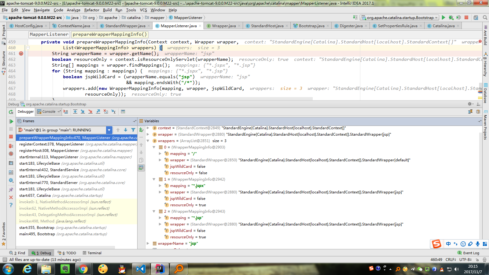

## StandardHost  ---> Mapper#MappedHost[] hosts
在start阶段加入。调用`Mapper#addHost()`方法。 匹配的时候主要是依据`StandardHost#name`属性。该属性的设置是在load阶段，解析`server.xml`文件的`<Host>`的`name`属性值得到，同时将所有大写字母都转换为了小写。

## StandardContext ---> Mapper$ContextList#MappedContext[] contexts
在start阶段加入. 调用`Mapper#addContextVersion()`方法。匹配的时候主要是依据`StandardContext#path`属性。该属性的设置是在`HostConfig#deployDirectory()`方法中。从目录名转换到path是在类`ContextName`的构造函数中处理的。例如：目录名"docs"对应的path是"/docs"。

## StandardWrapper ---> Mapper$ContextVersion的MappedWrapper defaultWrapper、MappedWrapper[] exactWrappers、MappedWrapper[] wildcardWrappers、MappedWrapper[] extensionWrappers
在start阶段加入. 调用`Mapper#addContextVersion()`方法。匹配的时候主要是依据`WrapperMappingInfo#mapping`属性。`WrapperMappingInfo`的创建是在`MapperListener#prepareWrapperMappingInfo()`方法中。每有一个<url-pattern>就创建一个`WrapperMappingInfo`。例如下面的名字为jsp的Servlet，对应的`WrapperMappingInfo`有三个（除了显示定义的，还有一个默认的，是之前加进去的）
```xml
   <servlet-mapping>
        <servlet-name>jsp</servlet-name>
        <url-pattern>*.jsp</url-pattern>
        <url-pattern>*.jspx</url-pattern>
    </servlet-mapping>
```



具体加入到`ContextVersion`中的哪个域中，是在`addWrapper()`方法中按照以下顺序决定的：
1. 如果`WrapperMappingInfo#mapping`是以`/*`结尾，则是Wildcard wrapper
2. 如果`WrapperMappingInfo#mapping`是以`*.`开始，则是Extension wrapper
3. 如果`WrapperMappingInfo#mapping`等于`/`，则是Default wrapper
4. 否则就是Exact wrapper
